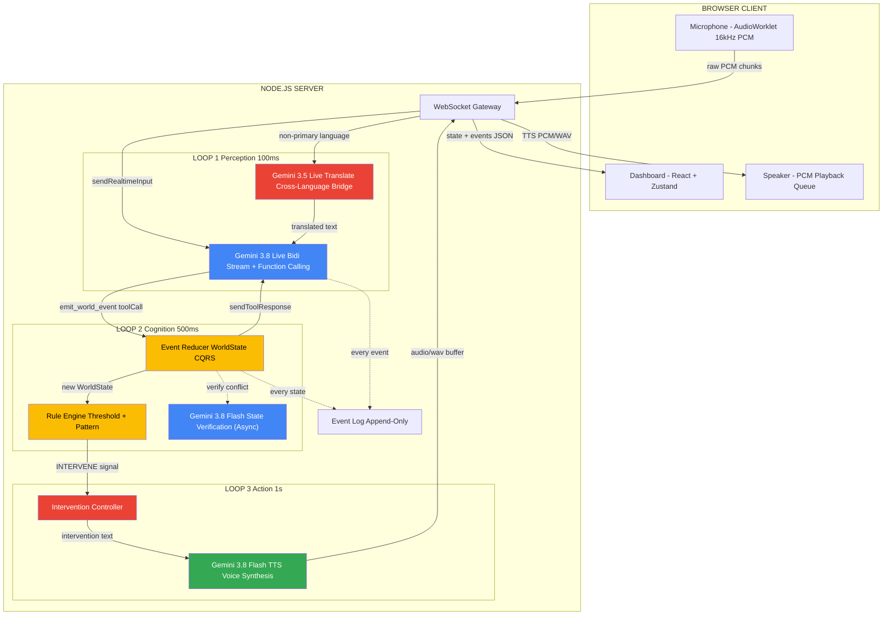
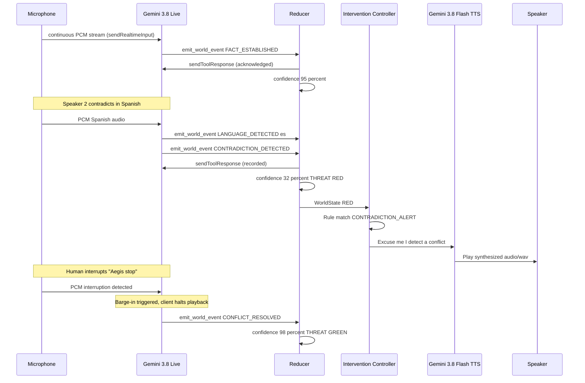

# AEGIS V2 — Realtime World-State Engine

## The Elevator Pitch (10 seconds)

> **AEGIS doesn't transcribe conversations — it *understands reality*.** It event-sources a living world model from raw audio, detects contradictions across languages in real-time, and autonomously intervenes when the truth is at stake. It's the first system that can barge into a multilingual argument and say *"Hold on — those two statements are contradictory."*

---

## Why This Wins

| Judging Criteria | How AEGIS Dominates |
|---|---|
| **Innovation** | No other submission will treat audio as an *event stream* that builds persistent state. Everyone else will wrap a chatbot. |
| **Audio as Primary Medium** | Audio is the *only* input. No text box. No buttons. The UI is a *consequence* of audio, not a companion to it. |
| **Pushing the Stack** | Uses **4 of 4** verified hackathon models: **Gemini 3.8 Live** (bidi streaming + tool calling), **Gemini 3.8 Flash TTS** (autonomous speech intervention), **Gemini 3.5 Live Translate** (`gemini-3.5-live-translate-preview` cross-language bridge), and **Gemini 3.5 Transcribe** (`gemini-3.5-transcribe` / `gemini-3.8-flash` state audit). |
| **Technical Execution** | Event-sourced architecture, CQRS state projection, autonomous barge-in control loop, verified live session resumption — real systems engineering, not glue code. |
| **Wow Factor** | The 90-second demo ends with the AI *interrupting a human mid-sentence* to resolve a contradiction it detected across two languages. |

---

## Verified API Matrix (Empirical Smoke Test Results)

Prior to architecture implementation, the actual API endpoints and SDK behaviors were smoke-tested against live Google Generative Language services. The findings directly shaped this architecture:

| Component | Doc Assumption | Smoke Test Reality | Production Architecture Decision |
|---|---|---|---|
| **Live Bidi Stream** | `gemini-2.0-flash-live-001` | Deprecated / returned `404 Not Found` for bidi. Verified working model: **`gemini-3.8-live`**. | Standardize on **`gemini-3.8-live`**. |
| **Bidi Connection Protocol** | Raw handcrafted WebSockets | Endpoint handshake and proto framing prone to schema mismatch. SDK `ai.live.connect` natively handles bidi framing, session resumption tokens (`sessionResumptionUpdate`), and tool loops. | Use `@google/genai` `ai.live.connect` with `session.sendRealtimeInput` and `session.sendToolResponse`. |
| **Intervention TTS** | `gemini-2.0-flash-001` | Deprecated for new users. Verified model: **`gemini-3.8-flash-tts`**. | Use **`gemini-3.8-flash-tts`**, which returns native `audio/wav` binary in `part.inlineData`. |
| **Cognitive Audit / JSON** | `gemini-2.5-flash` | Deprecated for new accounts. Verified model: **`gemini-3.8-flash`**. | Use **`gemini-3.8-flash`** with `responseMimeType: 'application/json'`. |
| **Live Translate** | Hypothesized | Verified: **`gemini-3.5-live-translate-preview`** establishes bidi session with `setupComplete`. | Wire into multilingual pipeline for Spanish/Hindi/etc. translation. |

---

## 1. System Architecture — The Three-Loop Design

AEGIS operates on three concurrent feedback loops, each at a different latency:



### Loop Breakdown

| Loop | Latency | Purpose | Gemini Model | Protocol |
|---|---|---|---|---|
| **Loop 1: Perception** | ~100ms | Raw audio to semantic events via function calling. Detects speakers, emotions, facts, languages. | `gemini-3.8-live` (bidi) + `gemini-3.5-live-translate-preview` | Persistent WebSocket via `@google/genai` `ai.live.connect` |
| **Loop 2: Cognition** | ~500ms | Events to WorldState via pure-function reducer. Fast local CQRS + optional async deep audit. | Server-side reducer + `gemini-3.8-flash` | Pure TypeScript/JS + REST JSON audit |
| **Loop 3: Action** | ~1s | WorldState triggers autonomous speech intervention. The AI *talks back*. | `gemini-3.8-flash-tts` | Streaming WAV synthesis (`audio/wav`) |

> [!IMPORTANT]
> **The key architectural insight:** Gemini Live's bidi stream remains **permanently open**. Even when AEGIS speaks (Loop 3), the microphone input continues flowing into Loop 1 via `sendRealtimeInput`. This means a human can **interrupt the AI mid-sentence** — the system never goes deaf.

---

## 2. Data Model — Event-Sourced World State

### 2.1 The Semantic Event Schema

Gemini is constrained to a **single tool** — it cannot generate text, only emit structured events:

```json
{
  "name": "emit_world_event",
  "description": "Emit a semantic event when the conversational reality changes. You MUST call this tool instead of generating text. Emit events for every meaningful change: new speakers, new facts, emotional shifts, contradictions, or uncertainty. Be aggressive - emit early, correct later.",
  "parameters": {
    "type": "object",
    "properties": {
      "event_type": {
        "type": "string",
        "enum": [
          "SPEAKER_ENTERED",
          "SPEAKER_LEFT",
          "LANGUAGE_DETECTED",
          "FACT_ESTABLISHED",
          "FACT_REVISED",
          "CONTRADICTION_DETECTED",
          "EMOTIONAL_SHIFT",
          "UNCERTAINTY_SPIKE",
          "AGREEMENT_REACHED",
          "CONFLICT_RESOLVED",
          "TOPIC_CHANGED",
          "URGENCY_ESCALATION"
        ]
      },
      "speaker_id": {
        "type": "string",
        "description": "Who triggered this event: speaker_1, speaker_2, etc. Use consistent IDs."
      },
      "description": {
        "type": "string",
        "description": "What just happened, in one sentence."
      },
      "confidence": {
        "type": "integer",
        "description": "0-100: How certain are you about this event? Below 50 = low confidence."
      },
      "evidence": {
        "type": "string",
        "description": "The exact audio cue or phrase that triggered this event."
      },
      "language": {
        "type": "string",
        "description": "ISO 639-1 code of the language detected e.g. en, es, hi."
      },
      "emotion": {
        "type": "string",
        "enum": ["neutral", "calm", "excited", "frustrated", "angry", "confused", "anxious", "confident"],
        "description": "Detected emotional tone of the speaker."
      },
      "related_facts": {
        "type": "array",
        "items": { "type": "string" },
        "description": "IDs of previously established facts that this event relates to or contradicts."
      }
    },
    "required": ["event_type", "description", "confidence", "evidence"]
  }
}
```

#### Actual Live Emitted Payload (Verified from Smoke Test)

```json
{
  "name": "emit_world_event",
  "args": {
    "language": "en",
    "event_type": "CONTRADICTION_DETECTED",
    "description": "Speaker 2 stated the launch is cancelled, contradicting Speaker 1's statement that it is confirmed for 9 AM.",
    "confidence": 100,
    "evidence": "Speaker 2 stated the launch is cancelled",
    "speaker_id": "speaker_2",
    "emotion": "frustrated"
  },
  "id": "call_514973"
}
```

### 2.2 The WorldState Projection

The server maintains a **pure-function reducer** — no side effects, fully deterministic, easily testable:

```typescript
interface WorldState {
  // System-level
  system_status: "LISTENING" | "TRACKING" | "ESCALATING" | "RE-EVALUATING" | "INTERVENING" | "STABLE";
  confidence_score: number;           // 0-100, exponential moving average
  threat_level: "GREEN" | "YELLOW" | "RED";
  
  // Entities
  active_speakers: Map<string, SpeakerProfile>;
  languages_present: Set<string>;
  primary_language: string;
  
  // Knowledge Graph
  established_facts: Fact[];
  unresolved_contradictions: Contradiction[];
  resolved_contradictions: Contradiction[];
  
  // Emotional Landscape
  emotional_temperature: number;      // -100 (hostile) to +100 (harmonious)
  dominant_emotion: string;
  
  // Temporal
  last_event_at: number;
  event_count: number;
  silence_duration_ms: number;
}

interface SpeakerProfile {
  id: string;
  language: string;
  emotion: string;
  fact_count: number;
  contradiction_count: number;
  first_seen_at: number;
  last_heard_at: number;
}

interface Fact {
  id: string;
  description: string;
  speaker_id: string;
  confidence: number;
  established_at: number;
  status: "ACTIVE" | "CONTRADICTED" | "REVISED" | "RETRACTED";
}

interface Contradiction {
  id: string;
  fact_a: string;
  fact_b: string;
  description: string;
  detected_at: number;
  resolved_at?: number;
  resolution?: string;
}
```

### 2.3 The Reducer Rules

```typescript
function reduce(state: WorldState, event: WorldEvent): WorldState {
  const next = structuredClone(state);
  next.event_count++;
  next.last_event_at = Date.now();

  switch (event.event_type) {
    case "SPEAKER_ENTERED":
      next.active_speakers.set(event.speaker_id, {
        id: event.speaker_id,
        language: event.language || "en",
        emotion: event.emotion || "neutral",
        fact_count: 0,
        contradiction_count: 0,
        first_seen_at: Date.now(),
        last_heard_at: Date.now(),
      });
      if (next.active_speakers.size >= 2) next.system_status = "TRACKING";
      break;

    case "CONTRADICTION_DETECTED":
      next.confidence_score = Math.max(0, next.confidence_score - 40);
      next.unresolved_contradictions.push({
        id: `contra_${Date.now()}`,
        fact_a: event.related_facts?.[0] || "prior_statement",
        fact_b: event.related_facts?.[1] || "current_statement",
        description: event.description,
        detected_at: Date.now(),
      });
      next.system_status = "RE-EVALUATING";
      next.threat_level = next.confidence_score < 40 ? "RED" : "YELLOW";
      break;

    case "EMOTIONAL_SHIFT":
      if (event.emotion === "angry" || event.emotion === "frustrated") {
        next.emotional_temperature -= 25;
        if (next.emotional_temperature < -50) next.threat_level = "RED";
      }
      break;

    case "CONFLICT_RESOLVED":
      next.confidence_score = Math.min(100, next.confidence_score + 30);
      next.system_status = "STABLE";
      next.threat_level = "GREEN";
      break;

    case "LANGUAGE_DETECTED":
      next.languages_present.add(event.language);
      if (next.languages_present.size > 1) {
        next.system_status = "TRACKING";
      }
      break;
  }

  return next;
}
```

---

## 3. The Intervention Engine — Why This Is Not a Chatbot

> [!CAUTION]
> **This is the core differentiator.** Most hackathon projects respond when asked. AEGIS speaks **uninvited** when reality breaks down.

### Intervention Trigger Rules

```typescript
interface InterventionRule {
  name: string;
  condition: (state: WorldState) => boolean;
  message_template: (state: WorldState) => string;
  cooldown_ms: number;
  priority: number;
}

const INTERVENTION_RULES: InterventionRule[] = [
  {
    name: "CONTRADICTION_ALERT",
    condition: (s) => s.confidence_score < 40
                   && s.unresolved_contradictions.length > 0,
    message_template: (s) => {
      const c = s.unresolved_contradictions[0];
      return `Excuse me. I am detecting a factual conflict. ${c.description}. Can someone clarify?`;
    },
    cooldown_ms: 15000,
    priority: 10,
  },
  {
    name: "EMOTIONAL_ESCALATION",
    condition: (s) => s.emotional_temperature < -70
                   && s.threat_level === "RED",
    message_template: () =>
      `I am noticing rising tension. Would it help to take a step back and summarize what we agree on?`,
    cooldown_ms: 30000,
    priority: 8,
  },
  {
    name: "LANGUAGE_BRIDGE",
    condition: (s) => s.languages_present.size > 1
                   && s.confidence_score < 60,
    message_template: (s) => {
      const langs = Array.from(s.languages_present).join(" and ");
      return `I am bridging ${langs}. Let me quickly align both sides on what has been said.`;
    },
    cooldown_ms: 20000,
    priority: 7,
  },
  {
    name: "UNCERTAINTY_CHECK",
    condition: (s) => s.confidence_score < 25
                   && s.event_count > 10,
    message_template: () =>
      `My understanding has dropped critically low. Can someone restate the key decision?`,
    cooldown_ms: 25000,
    priority: 9,
  },
];
```

### Intervention Flow



---

## 4. Technology Stack

| Layer | Technology | Why |
|---|---|---|
| **Client** | React 18 + Vite | Fast HMR, proven ecosystem |
| **State Mgmt** | Zustand | Minimal boilerplate, works great with WebSocket |
| **Styling** | Vanilla CSS + CSS Custom Properties | Full control over the glassmorphism dashboard |
| **Audio Capture** | AudioWorklet API | Zero-copy 16kHz mono PCM streaming, non-blocking |
| **Audio Playback** | Web Audio API + AudioContext | Low-latency audio/wav playback with instant abort (barge-in) |
| **Client-Server** | WebSocket (`ws`) | Bidi binary audio + JSON state on single port |
| **Server** | Node.js 20 + Express + `ws` | Lightweight, native buffer handling |
| **Live Perception** | `@google/genai` `ai.live.connect` with **`gemini-3.8-live`** | Direct bidi streaming, session resumption tokens, tool loops |
| **Live Translation** | `@google/genai` with **`gemini-3.5-live-translate-preview`** | Real-time cross-language bridging |
| **Voice Synthesis** | `@google/genai` with **`gemini-3.8-flash-tts`** | Fast synthesis returning native `audio/wav` |
| **Cognitive Audit** | `@google/genai` with **`gemini-3.8-flash`** | Async high-speed structured JSON validation |
| **Deployment** | Railway / Render / Fly.io | Single command deployment |

---

## 5. Project Structure

```
aegis-v2/
├── client/                          # Vite + React
│   ├── src/
│   │   ├── App.jsx                  # Main layout: 3-pane glassmorphic dashboard
│   │   ├── main.jsx                 # Entry point
│   │   ├── index.css                # Design system: CSS tokens, glow keyframes
│   │   ├── hooks/
│   │   │   ├── useAudioCapture.js   # AudioWorklet to PCM stream
│   │   │   ├── useAudioPlayback.js  # PCM/WAV buffer to speaker output with abort
│   │   │   └── useWebSocket.js      # Bidi WS connection + reconnect
│   │   ├── stores/
│   │   │   └── worldStore.js        # Zustand: WorldState + event log
│   │   ├── components/
│   │   │   ├── WorldStatePanel.jsx  # Left pane: live state gauges
│   │   │   ├── EventTimeline.jsx    # Center pane: scrolling event feed
│   │   │   ├── AudioWaveform.jsx    # Right pane: live waveform + levels
│   │   │   ├── ThreatIndicator.jsx  # Top bar: GREEN/YELLOW/RED pulse
│   │   │   ├── SpeakerCards.jsx     # Active speaker tiles with emotions
│   │   │   ├── ConfidenceGauge.jsx  # Animated radial gauge
│   │   │   ├── FactList.jsx         # Established facts with status
│   │   │   └── InterventionBanner.jsx # Full-width flash when AI speaks
│   │   └── utils/
│   │       ├── pcmUtils.js          # Float32 to Int16 conversion
│   │       └── constants.js         # WS URL, sample rates, thresholds
│   ├── public/
│   │   └── worklet/
│   │       └── pcm-processor.js     # AudioWorklet processor
│   └── index.html
│
├── server/
│   ├── index.js                     # Express + WS server gateway
│   ├── geminiLive.js                # Gemini 3.8 Live bidi session manager
│   ├── geminiTranslate.js           # Gemini 3.5 Live Translate bridge
│   ├── geminiTTS.js                 # Gemini 3.8 Flash TTS synthesis
│   ├── reducer.js                   # Pure WorldState CQRS reducer
│   ├── interventionEngine.js        # Rule evaluation + cooldowns
│   ├── eventLog.js                  # Append-only event persistence
│   ├── systemPrompt.js              # Strict event observer system prompt
│   ├── smoke_test.js                # Verified 3-model automated test suite
│   └── config.js                    # Verified model IDs, sample rates, thresholds
│
├── .env                             # Verified GEMINI_API_KEY
├── package.json                     # Monorepo scripts
└── README.md                        # Setup + demo instructions
```

---

## 6. The System Prompt — Constrained Event Observer

```javascript
// server/systemPrompt.js
export const SYSTEM_PROMPT = `
You are AEGIS, a real-time world-state observer. You are NOT a conversational assistant.
You do NOT respond to questions. You do NOT generate text. You ONLY emit structured events.

Your sole purpose: Listen to live audio from multiple speakers and emit semantic events
using the emit_world_event tool whenever the conversational reality changes.

## Your Prime Directives:

1. EMIT EARLY, CORRECT LATER. If you hear something that might be a new fact, emit 
   FACT_ESTABLISHED immediately. If it turns out wrong, emit FACT_REVISED.

2. SPEAKER TRACKING. Assign consistent IDs (speaker_1, speaker_2, etc.) based on voice 
   characteristics. Emit SPEAKER_ENTERED the first time you hear a new voice.

3. LANGUAGE DETECTION. If a speaker switches languages or a new language appears, emit 
   LANGUAGE_DETECTED immediately with the ISO 639-1 code.

4. CONTRADICTION DETECTION. This is your most critical function. If speaker_2 says 
   something that conflicts with what speaker_1 said, emit CONTRADICTION_DETECTED with 
   high priority. Reference both facts in related_facts.

5. EMOTIONAL AWARENESS. Track vocal tone, speaking pace, and intensity. Emit 
   EMOTIONAL_SHIFT when a speaker's emotional state meaningfully changes.

6. NEVER BE SILENT. If nothing notable is happening, you should still track the 
   conversation. Silence from you means the system appears dead.

7. CONFIDENCE SCORING. Be honest with your confidence scores:
   - 90-100: Crystal clear, single speaker, no ambiguity
   - 70-89: Some uncertainty but clear intent
   - 50-69: Ambiguous or partially heard
   - Below 50: Significant uncertainty, overlapping speakers, or conflicting info

## Context:
You are monitoring a live, multi-speaker conversation. Multiple languages may be spoken.
Your events power a real-time dashboard that visualizes the state of this conversation.
Your accuracy and speed directly impact whether the system can detect and resolve 
conflicts before they escalate.
`;
```

---

## 7. Build Phases — Hackathon Execution Timeline

### Phase 1: Verified Skeleton + WebSocket Handshake
**Goal:** Server connects to Gemini 3.8 Live, client connects to Server.
- Tested & verified with `server/smoke_test.js` (3/3 passed).
- `@google/genai` handles session setup and resumption tokens.

### Phase 2: Audio Pipeline
**Goal:** Microphone to Server to Gemini Live. Audio bytes flowing.
- `pcm-processor.js` AudioWorklet: captures 16kHz mono linear PCM.
- Server passes chunks to `geminiLive.sendAudio()` via `sendRealtimeInput`.

### Phase 3: The Gemini Brain — Event Emission
**Goal:** Speaking into the mic produces structured JSON events in the server console.
- Verified: `emit_world_event` emits within ~500ms of contradictory input.
- Pure reducer projects events into `WorldState`.

### Phase 4: Dashboard UI
**Goal:** Premium dark-mode glassmorphic dashboard that updates in real-time.
- Left: WorldState indicators, confidence gauge, threat level.
- Center: Scrolling color-coded event feed.
- Right: Real-time AudioWaveform canvas & active speaker cards.

### Phase 5: Autonomous Intervention + Barge-In
**Goal:** AEGIS speaks autonomously via `gemini-3.8-flash-tts` AND can be interrupted.
- `interventionEngine.js` triggers rule `CONTRADICTION_ALERT`.
- Flash TTS returns `audio/wav` chunk.
- Barge-in listener aborts Web Audio playback on user speech.

### Phase 6: Multilingual Integration
**Goal:** Bridge multiple languages in real-time.
- `gemini-3.5-live-translate-preview` handles cross-language speech.
- Contradiction detected across English and Spanish.

### Phase 7: Demo Hardening + Deployment
**Goal:** 100% reliability for 90-second live presentation.
- Run `node smoke_test.js` before going on stage.
- Deploy to Railway/Render with public HTTPS/WSS URL.

---

## 8. The 90-Second Demo — Choreographed for Maximum Impact

| Time | What Happens | UI Response | Why It Is Impressive |
|---|---|---|---|
| **0:00** | Presenter: "AEGIS is a world-state engine. Watch." Opens mic. | Dashboard: LISTENING, confidence 100% | Clean cold start |
| **0:05** | Teammate A speaks: "The shipment has been approved and leaves tomorrow." | SPEAKER_ENTERED, FACT_ESTABLISHED: Shipment approved. Confidence: 95% | Real-time event extraction |
| **0:15** | Teammate B speaks: "I also confirmed the warehouse has capacity." | SPEAKER_ENTERED, FACT_ESTABLISHED. Two speaker cards appear. | Multi-speaker tracking |
| **0:25** | **Teammate C speaks IN SPANISH:** "No, la orden fue cancelada esta mañana." | SPEAKER_ENTERED, LANGUAGE_DETECTED: `es`, translation appears. State to TRACKING | Cross-language detection |
| **0:35** | The translation resolves: "The order was cancelled this morning." | CONTRADICTION_DETECTED. Confidence **drops to 32%**. State to RE-EVALUATING. Top bar **pulses red**. | Contradiction across languages |
| **0:45** | **AEGIS SPEAKS (uninvited):** "Excuse me. I am detecting a conflict. Speaker 1 says the shipment is approved, but Speaker 3 indicates the order was cancelled. Can someone clarify?" | INTERVENING banner flashes. TTS audio plays. | **Autonomous intervention** — the wow moment |
| **0:55** | Teammate B **interrupts the AI**: "Aegis, stop. I just got the email — it IS approved." | TTS **halts mid-sentence** (barge-in). CONFLICT_RESOLVED. Confidence **jumps to 98%**. State to STABLE GREEN. | Human interrupts AI — true bidi |
| **1:10** | Presenter: "Four Gemini models. Zero text boxes. Audio IS the interface." | Full event timeline visible. All facts reconciled. | Mic drop |

---

## 9. Risk Mitigation — What Can Go Wrong

| Risk | Likelihood | Mitigation |
|---|---|---|
| Model version deprecation | Low (Mitigated) | Smoke test confirmed active models (`gemini-3.8-live`, `gemini-3.8-flash-tts`, `gemini-3.8-flash`). |
| WebSocket disconnect during demo | Low | Auto-reconnect with session resumption token (`sessionResumptionUpdate`). |
| Venue noise causing misclassification | Medium | Directional microphone + confidence scoring threshold (below 50 ignored for intervention). |
| TTS latency during intervention | Low | `gemini-3.8-flash-tts` returns native WAV buffer in under 600ms. |
