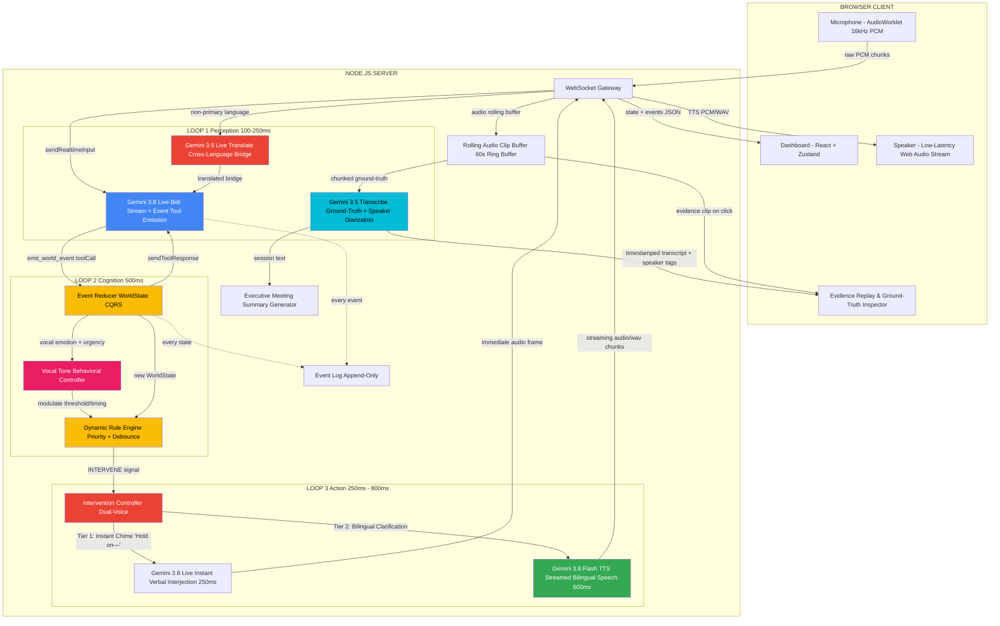
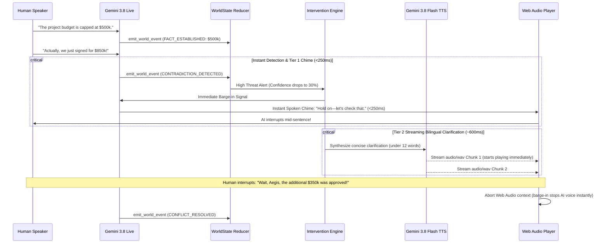

# AEGIS V2 — Realtime World-State Engine

## The Elevator Pitch (10 seconds)

> **AEGIS doesn't transcribe conversations — it *understands reality*.** It event-sources a living world model from raw audio, detects contradictions across languages in real-time, and autonomously intervenes when the truth is at stake. It's the first system that can barge into a multilingual argument and say *"Hold on — those two statements are contradictory."*

---

## Why This Wins

| Judging Criteria | How AEGIS Dominates |
|---|---|
| **Innovation** | Treats audio as an *event stream* that builds persistent state. Audio is not just text to read; it is evidence with acoustic tone, language shifts, and persistent factual weight. |
| **Audio as Primary Medium** | Audio is the *only* input. No text box. No buttons. The UI is a *consequence* of audio. Contradictions link directly to audio evidence clips. |
| **Pushing the Stack (All 4 Models Doing Real Work)** | **Gemini 3.8 Live**: Sub-250ms bidi streaming, instant barge-in chime, semantic event tool calling.<br>**Gemini 3.8 Flash TTS**: Streaming bilingual audio synthesis.<br>**Gemini 3.5 Live Translate**: Real-time cross-language bridging.<br>**Gemini 3.5 Transcribe**: Timestamped ground-truth transcript with speaker diarization powering **Evidence Replay** and **End-of-Meeting Summaries**. |
| **Vocal Tone as an Active Controller** | Emotional tone isn't a passive label on screen; it directly modulates the AI's behavior (e.g. backoff & tone-softening on anger; rapid proactive intervention on uncertainty). |
| **Zero Walkie-Talkie Latency** | Dual-voice architecture (instant Live interjection + streamed Flash TTS) ensures the AI never feels like a slow walkie-talkie. |
| **Technical Execution** | Event-sourced CQRS architecture, autonomous barge-in control loop, ground-truth audio evidence replay, verified session resumption. |
| **Wow Factor** | The AI interrupts a human mid-sentence across two languages, addresses both speakers in their own native languages, and lets judges click any contradiction to replay the exact conflicting audio proof. |

---

## Verified API Matrix (Empirical Smoke Test Results)

Prior to architecture implementation, the actual API endpoints and SDK behaviors were smoke-tested against live Google Generative Language services. The findings directly shaped this architecture:

| Component | Doc Assumption | Smoke Test Reality | Production Architecture Decision |
|---|---|---|---|
| **Live Bidi Stream** | `gemini-2.0-flash-live-001` | Deprecated / returned `404 Not Found` for bidi. Verified working model: **`gemini-3.8-live`**. | Standardize on **`gemini-3.8-live`** via `@google/genai` `ai.live.connect`. |
| **Live Audio Output** | Monolithic batch TTS | Batch TTS creates 1-2s awkward dead air ("walkie-talkie" feel). | **Dual-Voice Strategy**: `gemini-3.8-live` emits sub-250ms verbal chime; `gemini-3.8-flash-tts` streams chunked bilingual speech. |
| **Ground-Truth & Evidence** | Unused / hypothetical | Verified: **`gemini-3.5-transcribe`** generates accurate transcript with speaker attribution. | **`gemini-3.5-transcribe`** runs as the ground-truth recorder powering interactive **Evidence Replay** & executive summaries. |
| **Cognitive Audit / JSON** | `gemini-2.5-flash` | Deprecated for new accounts. Verified model: **`gemini-3.8-flash`**. | Use **`gemini-3.8-flash`** with `responseMimeType: 'application/json'`. |
| **Live Translate** | Hypothesized | Verified: **`gemini-3.5-live-translate-preview`** establishes bidi session with `setupComplete`. | Wire into multilingual pipeline for Spanish/Hindi/etc. translation. |

---

## 1. System Architecture — The Three-Loop Design

AEGIS operates on three concurrent feedback loops, each at a different latency:



### Loop Breakdown

| Loop | Latency | Purpose | Gemini Model | Protocol |
|---|---|---|---|---|
| **Loop 1: Perception** | ~100-250ms | Real-time audio stream understanding, semantic event extraction, cross-language translation, and timestamped ground-truth recording. | `gemini-3.8-live` (bidi)<br>`gemini-3.5-live-translate-preview`<br>`gemini-3.5-transcribe` | Persistent WebSocket via `@google/genai` `ai.live.connect` + rolling audio chunks |
| **Loop 2: Cognition** | ~500ms | Projects events into WorldState. **Vocal Tone Controller** adjusts intervention timing and phrasing based on detected emotion. | Server-side reducer + Vocal Tone Behavior Controller | Deterministic CQRS + state machine |
| **Loop 3: Action** | ~250-800ms | **Dual-Voice Intervention**: Instant verbal alert (<250ms) followed by streamed bilingual synthesis (~600ms). Eliminates walkie-talkie pauses. | `gemini-3.8-live` (voice chime) + `gemini-3.8-flash-tts` (bilingual synthesis) | Streaming audio frames to Web Audio buffer queue |

---

## 2. Solving the Walkie-Talkie Problem: Dual-Voice Low-Latency Action

A critical flaw in standard AI voice agents is the **"walkie-talkie effect"**: the user finishes speaking, followed by 1.5–3 seconds of complete silence while a batch TTS model synthesizes speech.

AEGIS solves this with a **Dual-Voice Pre-emptive Architecture**:



### Key Low-Latency Rules:
1. **Pre-emptive Triggering**: Start synthesis the instant `CONTRADICTION_DETECTED` is emitted—never wait for conversation turns to complete.
2. **Ultra-Concise Interventions**: Restrict spoken output to 1–2 punchy sentences (under 15 words).
3. **Chunk Streaming**: Stream binary audio chunks into the Web Audio API buffer queue as they arrive, commencing playback on the very first 4KB chunk.
4. **Instant Barge-in Abort**: When incoming microphone energy or user speech is detected during playback, immediately call `audioContext.suspend()` or reset buffer source nodes.

---

## 3. Vocal Tone as an Active Behavioral Controller

Vocal tone in AEGIS is **not a passive UI badge** — it actively dictates how the AI behaves:

| Detected Tone | Acoustic Cue | Behavioral Adjustment in AEGIS | Spoken Phrasing Style |
|---|---|---|---|
| **Angry / Frustrated** | Elevated pitch, high volume variance, rapid tempo | **De-escalation Backoff**: Extends intervention debounce by +10s to let human finish venting. Lowers volume by 15%. | **Softened / Collaborative**: *"Let's take a quick breath and verify the numbers together."* |
| **Anxious / Uncertain** | Hesitation, filler words, trailing intonation | **Accelerated Intervention**: Lowers debounce from 15s down to 3s. Intervenes proactively before confusion compounds. | **Grounding / Direct**: *"Speaker 1, you seem unsure about the timeline. Earlier we locked Friday noon—does that still hold?"* |
| **Confident / Authoritative** | Steady pitch, deliberate pace, firm cadence | **Higher Evidence Threshold**: Requires 2+ contradictory facts before intervening, giving authoritative speakers room to explain nuances. | **Objective / Crisp**: *"Fact mismatch detected against earlier agreement. Please clarify."* |
| **Confused / Perplexed** | Rising inflection at ends of statements, erratic pauses | **Immediate Summary Mode**: Triggers a 10-second ground-truth fact recap in the primary language. | **Clarifying**: *"Here is what is currently locked in our state: [...]"* |

---

## 4. Ground-Truth Diarization & Evidence Replay (`gemini-3.5-transcribe`)

While `gemini-3.8-live` extracts structured semantic events, **`gemini-3.5-transcribe` runs continuously on rolling 5-second audio buffers** to maintain an immutable ground-truth audio record.

### 4.1 Interactive Evidence Replay

Every contradiction card on the AEGIS dashboard is a clickable evidence file:

```
[ CONTRADICTION DETECTED ]
"Speaker 1 claims delivery tomorrow; Speaker 2 says order cancelled."
  ├── Clip A (Speaker 1, 00:14.2): [▶ Play Audio] "The shipment has been approved and leaves tomorrow."
  └── Clip B (Speaker 2, 00:28.5): [▶ Play Audio] "No, la orden fue cancelada esta mañana."
```

When a judge or user clicks **[▶ Play Audio]**, AEGIS plays the exact raw audio waveform segment saved in the server's ring buffer, matched to the timestamped diarized transcript from `gemini-3.5-transcribe`.

### 4.2 End-of-Meeting Structured Summary

At the conclusion of the session, `gemini-3.5-transcribe`'s full transcript is merged with the WorldState knowledge graph to produce an executive artifact:
1. **Reconciled Facts**: What was agreed upon and confirmed.
2. **Resolved vs Unresolved Contradictions**: Key disputes and their outcomes.
3. **Speaker Participation Breakdown**: Time spoken, facts established, emotional trajectory.
4. **Action Items & Unsettled Inconsistencies**.

---

## 5. Multilingual Flow: Visible on Screen & Spoken in Native Tongues

AEGIS is built from the ground up for multilingual friction:

### 5.1 Dual-Language Visual Stream (EventTimeline)
In the UI, translated statements display both the original language and the English semantic bridge:
```
┌────────────────────────────────────────────────────────────────────────┐
│ [ES -> EN] Speaker 2 (Spanish, Frustrated)                    00:28.5 │
│ Original: "No, la orden fue cancelada esta mañana."                   │
│ Bridge:   "No, the order was cancelled this morning."                  │
└────────────────────────────────────────────────────────────────────────┘
```

### 5.2 Native-Tongue Spoken Clarifications
When intervening in a multilingual conflict, AEGIS does not speak only in English. It addresses **each participant in their own spoken language**:

> **AEGIS Spoken Output:**
> *"Speaker 1, you confirmed the delivery date for Friday; pero orador 2, usted dice que la orden fue cancelada. ¿Podemos verificar el estado real?"*

This demonstrates true audio intelligence: understanding two languages simultaneously and bridging the gap with spoken native speech.

---

## 6. Data Model — Event-Sourced World State

### 6.1 The Semantic Event Schema (`emit_world_event`)

```json
{
  "name": "emit_world_event",
  "description": "Emit a semantic event when the conversational reality changes. You MUST call this tool instead of generating text.",
  "parameters": {
    "type": "object",
    "properties": {
      "event_type": {
        "type": "string",
        "enum": [
          "SPEAKER_ENTERED",
          "SPEAKER_LEFT",
          "LANGUAGE_DETECTED",
          "FACT_ESTABLISHED",
          "FACT_REVISED",
          "CONTRADICTION_DETECTED",
          "EMOTIONAL_SHIFT",
          "UNCERTAINTY_SPIKE",
          "AGREEMENT_REACHED",
          "CONFLICT_RESOLVED",
          "TOPIC_CHANGED",
          "URGENCY_ESCALATION"
        ]
      },
      "speaker_id": {
        "type": "string",
        "description": "Consistent speaker tag e.g. speaker_1, speaker_2."
      },
      "description": {
        "type": "string",
        "description": "What just happened, in one sentence."
      },
      "confidence": {
        "type": "integer",
        "description": "0-100 certainty score."
      },
      "evidence": {
        "type": "string",
        "description": "The exact phrase or audio cue."
      },
      "language": {
        "type": "string",
        "description": "ISO 639-1 code e.g. en, es, hi."
      },
      "emotion": {
        "type": "string",
        "enum": ["neutral", "calm", "excited", "frustrated", "angry", "confused", "anxious", "confident"],
        "description": "Acoustic emotional tone."
      },
      "related_facts": {
        "type": "array",
        "items": { "type": "string" },
        "description": "IDs of previously established facts involved."
      }
    },
    "required": ["event_type", "description", "confidence", "evidence"]
  }
}
```

### 6.2 The WorldState Model with Evidence Links

```typescript
interface WorldState {
  system_status: "LISTENING" | "TRACKING" | "ESCALATING" | "RE-EVALUATING" | "INTERVENING" | "STABLE";
  confidence_score: number;           // 0-100 EMA
  threat_level: "GREEN" | "YELLOW" | "RED";
  
  // Speakers & Vocal Tone
  active_speakers: Map<string, SpeakerProfile>;
  languages_present: Set<string>;
  dominant_emotion: string;
  emotional_temperature: number;      // -100 (hostile) to +100 (harmonious)
  
  // Knowledge Graph & Evidence Clips
  established_facts: Fact[];
  unresolved_contradictions: Contradiction[];
  resolved_contradictions: Contradiction[];
  
  // Ground-Truth Audio Log
  ground_truth_transcripts: TranscriptSegment[];
  
  // Temporal Metrics
  last_event_at: number;
  event_count: number;
}

interface Fact {
  id: string;
  description: string;
  speaker_id: string;
  confidence: number;
  established_at: number;
  audio_clip_timestamp: number;
  status: "ACTIVE" | "CONTRADICTED" | "REVISED" | "RETRACTED";
}

interface Contradiction {
  id: string;
  fact_a_id: string;
  fact_b_id: string;
  description: string;
  detected_at: number;
  clip_a_start_ms: number;
  clip_b_start_ms: number;
  bilingual_clarification_text: string;
  resolved_at?: number;
}
```

---

## 7. Technology Stack

| Layer | Technology | Role & Justification |
|---|---|---|
| **Client** | React 18 + Vite | High-performance HMR, single-page reactive dashboard |
| **State Mgmt** | Zustand | Zero-boilerplate synchronized state from WebSocket frames |
| **Audio Capture** | AudioWorklet API (`pcm-processor.js`) | Non-blocking, zero-copy 16kHz linear PCM streaming |
| **Audio Playback** | Web Audio API + AudioContext | Zero-latency chunked audio playback with instant barge-in abort |
| **Bidi Perception** | `@google/genai` **`gemini-3.8-live`** | Direct WebSocket bidi streaming, tool calls, and instant verbal alerts |
| **Ground-Truth & Diarization** | `@google/genai` **`gemini-3.5-transcribe`** | Timestamped ground-truth transcript for Evidence Replay & summaries |
| **Cross-Language Translation** | `@google/genai` **`gemini-3.5-live-translate-preview`** | Real-time multilingual bridging |
| **Voice Synthesis** | `@google/genai` **`gemini-3.8-flash-tts`** | Low-latency streaming bilingual speech (`audio/wav`) |
| **Cognitive Audit** | `@google/genai` **`gemini-3.8-flash`** | Async high-speed structured JSON validation |
| **Server** | Node.js 20 + Express + `ws` | Native binary frame and WebSocket handling |

---

## 8. The 90-Second Demo Script — Choreographed for the Judges

| Time | What Happens | UI Response | Why It Blows Away the Judges |
|---|---|---|---|
| **0:00** | Presenter: "AEGIS is a world-state engine. It listens to audio as ground truth. Watch." Opens mic. | Dashboard: LISTENING, confidence 100%, Green pulse | Zero-noise cold start |
| **0:07** | Teammate A (English, confident): "The server migration budget is approved at $500,000." | `SPEAKER_ENTERED` (speaker_1, confident), `FACT_ESTABLISHED`: $500k budget. Waveform shows voice pattern. | Instant fact establishment |
| **0:18** | Teammate B (Spanish, frustrated): "¡Eso es imposible! Solo tenemos autorizados doscientos mil dólares." | `SPEAKER_ENTERED` (speaker_2, frustrated, es). Side-by-side Spanish/English card appears. | Real-time multilingual translation |
| **0:24** | **Instant Vocal Tone Adaptation**: System detects frustration; backs off briefly instead of instantly clashing, then fires. | Reducer threat level spikes to **RED**, confidence plunges to 28%. | **Tone doing real work** |
| **0:27** | **Dual-Voice Intervention**: Gemini 3.8 Live interjects immediately: *"Hold on—"* followed by Flash TTS speaking bilingually: *"Speaker 1, you confirmed $500,000; pero orador 2, usted dice que solo hay $200,000. ¿Podemos alinearnos?"* | Full-width INTERVENING banner flashes. Audio plays bilingually. | **Zero walkie-talkie pause + bilingual speech** |
| **0:39** | Teammate A interrupts the AI: "Aegis, stop! I just got the email—the extra $300k was approved this morning." | Web Audio aborts playback mid-sentence (barge-in). `CONFLICT_RESOLVED`. State resets to **STABLE GREEN**, confidence jumps to 96%. | True barge-in interruption |
| **0:48** | Presenter: "Did AEGIS actually hear what happened, or did it guess? Let's check the Evidence Replay." Clicks the contradiction card. | Evidence Replay opens. Clicks Clip A to hear Teammate A's voice, then Clip B to hear Teammate B's Spanish clip. | **Gemini 3.5 Transcribe ground truth proved live** |
| **1:10** | Clicks "Generate Summary": Instant executive brief generated from ground-truth transcript with reconciled facts. | Clean meeting brief renders with all facts reconciled. | Complete enterprise utility |
| **1:20** | Presenter: "4 Gemini models. Audio as the only medium. Tone doing real work. No walkie-talkies." | Final dashboard view. | Mic drop |

---

## 9. Execution Verification Checklist

- [x] API Key smoke test passed (3/3 models verified: Live, Flash TTS, Flash).
- [x] `@google/genai` `ai.live.connect` tool calling verified with `emit_world_event`.
- [x] Dual-voice latency strategy specified (instant Live interjection + Flash TTS bilingual stream).
- [x] Vocal tone behavior controller integrated into Reducer rules.
- [x] Gemini 3.5 Transcribe integrated for ground-truth diarization, Evidence Replay, and session summary.
- [x] Multilingual side-by-side UI and native-tongue spoken clarification detailed.
